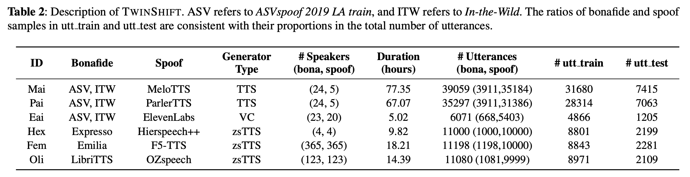

# TwinShift: Benchmarking Audio Deepfake Detection across Synthesizer and Speaker Shifts

## Abstract 
Audio deepfakes pose a growing threat, already exploited in fraud and misinformation. A key challenge is ensuring detectors remain robust to unseen synthesis methods and diverse speakers, since generation techniques evolve quickly. Despite strong benchmark results, current systems struggle to generalize to new conditions limiting real-world reliability. To address this, we introduce _TWINSHIFT_, a benchmark explicitly designed to evaluate detection robustness under strictly unseen conditions. Our benchmark is constructed from six different synthesis systems, each paired with disjoint sets of speakers, allowing for a rigorous assessment of how well detectors generalize when both the generative model and the speaker identity change. Through extensive experiments, we show that _TWINSHIFT_ reveals important robustness gaps, uncover overlooked limitations, and provide principled guidance for developing ADD systems.

## Download _TWINSHIFT_ Dataset
### Metadata
<https://zenodo.org/records/17199008>

### Download Bonafide
- ASVspoof2019 (ODC-BY 1.0, <https://datashare.ed.ac.uk/handle/10283/3336>)
- In-the-Wild (Apache License 2.0, <https://deepfake-total.com/in_the_wild>)
- Emilia (CC BY-NC 4.0, <https://huggingface.co/datasets/amphion/Emilia-Dataset>)
- Expresso (CC BY-NC 4.0, <https://huggingface.co/datasets/ylacombe/expresso>)
- LibriTTS train-clean-100 (CC BY 4.0, <https://www.openslr.org/60/>)

## Description of _TWINSHIFT_

